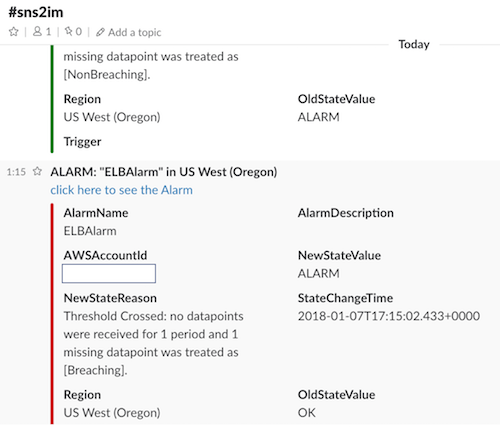

# sns2slack

sns2slack is a serverless relay service forwarding the incoming SNS messages to your Slack channel with SNS HTTPS endpoint subscription.

Similar to [sns2chime](https://github.com/pahud/sns2chime), all you need to do is grab the original slack incoming webhook URL and rename the domain from **hooks.slack.com** to **hooks.slack.serverless.im** and all done.

Made with ❤️ by Pahud Hsieh. Available on the [AWS Serverless Application Repository](https://aws.amazon.com/serverless)

## Features

1. No Lamba authoring, one-click from [AWS Serverless Application Repository](https://aws.amazon.com/serverless) to deploy the stack
2. public demo available, just rewrite the domain from **hooks.slack.com** to **hooks.slack.serverless.im** and all done.
3. severity coloring support (red/orange/green)
4. one click to the alarm  supported

## License

Apache License 2.0 (Apache-2.0)
